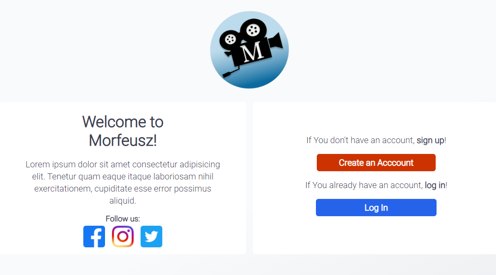
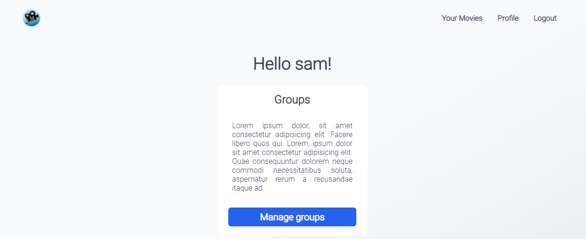
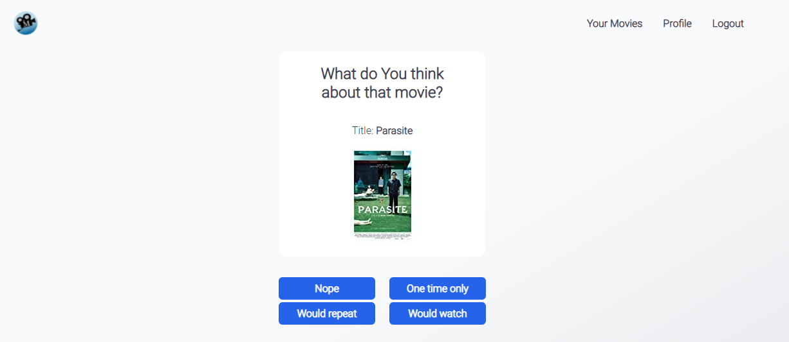
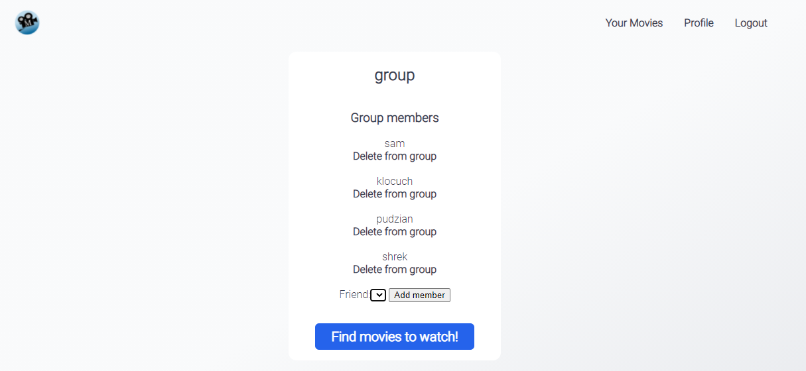

# MORFEUSZ
(Movies Open Reliable Finder Extra User-friendly Search-engine Zero)

available at: [morfeusz.herokuapp.com](morfeusz.herokuapp.com)
(you might need to waint up to 3 min. for page to load at first becose heroku account is not premium, so it needs to build up the whole page from the begining)
___

Project participants:
- Rafał Damian (team leader),
- Alicja Szemalikowska,
- Patrycja Potępa,
- Karol Fułat,
- Krzysztof Dziadkowiec,

## Short description of the idea:
Tinder for movies. App for deciding what movies to watch with Your friends, based on Your preferences.

## Technology stack:
- Back-end: Django, PostgreSQL, Heroku
- Django Templates (HTML / CSS)

## Features:
1. creating and managing your account,
1. adding friends, creating friends groups,
1. searching movies
1. adding films to favorites
1. comparing and matching films you want to watch with films of your friends/groups
1. machine learning algorithm for predicting movie's characteristics from its cover,
1. adding movies’ posters
1. all of this working on Heroku with debug turned to OFF

---
After entering the application, we are greeted by the login page. We can create a new account there, or log in to an existing one

After logging in to your account, you can manane one of your groups of friends or choose one of the options at the top, such as going to your profile.

Inside your profile you can go to **movies qualifier**. The algorithm will give you one of the movies from IMDB database that you have not rated for you to rate. Then you have to choose one of the four options shown below the movie poster. Your choice will affect the algorithm's assessment of your film preferences. The more movies you rate the better this assessment will be.

Inside your profile, you can also add and remove friends as well as change your profile picture. This photo also has an influence on the assessment of your movie preferences. **Machine Learing** algorithm will determine, based on your picture, what genre suits it best. This assessment also translates into the final result of selecting films.

Inside the group, you can add and remove members. When the group composition is finished, press the  **Find movies to watch** button and the algorithm will create a weighted profile of garage preferences, and based on it and the ratings of movies in the iMDB database, I will find the best movies to watch.

## Roadmap:
### sprint 1 (-10.05.2021): 
- research report: (P. Potępa)
  - data sources
  - how to get characteristic of the movie
  - machine learning on this dataset
- basic structure of project (everyone)
- user registration (A. Szemalikowska)
- integration with heroku (R. Damian)
- connecting PostgreSQL to Django and Heroku(R. Damian)
- connecting to IMDb film database (K. Fułat)

### sprint 2 (10.05.2021 - 20.05.2021): 
- Basic UI layout (K. Dziadkowiec)
- friends funcionality (A. Szemalikowska)
- adding films to favorites (K. Fułat)
- comparing and matching films between users/groups (R. Damian)
- poster database (P. Potępa)

### sprint 3 (20.05.2021 - 31.05.2020): 
- machine learning implementation (P. Potepa, R. Damian)
- writing tests (R. Damian, K. Fułat, A. Szemalikowska)

 
